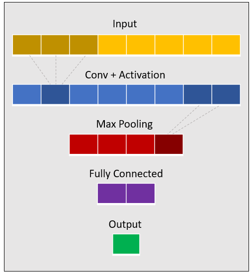

## Machine Learning Module
This module provides two models to detect anomalies in flow logs, both are based on neural networks.
### Detect Anomalies with Fully Convolutional Network (FCN)
This network is designed to detect *contextual anomalies* in 1d time series. Given k-consequtive values of a time series,
the network tries to predict the next value. Anomalies can be defined as the values which the network fails to predict.

#### Structure
This model is implemented by a (potentially deep) neural network, which consists of 4 layers: Input, output, a convolution layer 
and a fully-connected layer. The convolution is performed in the temporal axis, relying on the existence of temporal patterns
in the input. 

  

#### How to Use

1.  Use *shingle()* to create the data set and the labels set. Each data point consists of k-consecutive values of the time series,
and each label is the next value of the time series.  
2. Split each set into train and test sets, and feed the network.  
3. Assign an anomaly score for each instance (the distance between the predicted and the real values, calculated by some metric).  
4. Define the instances that received the highest scores as anomalous.

### Advanced Features of Machine Learning Module
Both FCN and AE are implemented in Tensorflow, providing the developer full control over the network structure. 
Inspired by higher-level modules such as Keras, the following features are embedded in Analytics Machine Learning functions:
* Continous Learning. Both models are designed to deal with continous tasks, in which the network might be trained multiple times
with different data sets. By passing *is_initial=False*, the previous Tensorflow graph is being resotred, allowing the training phase
to resume from the point it stopped.
* Overfitting Avoidance. This feature can be achieved by using one (or more) of the following mechanisms:
  1. Early Stopping - Stops the training phase when the test error increases in multiple consecutive epochs (the amount is defined by *tolerance*).
  2. Regularization - Limits the size of the network weights by adding a regularization term to the objective (defined by *reg_coeff*).
