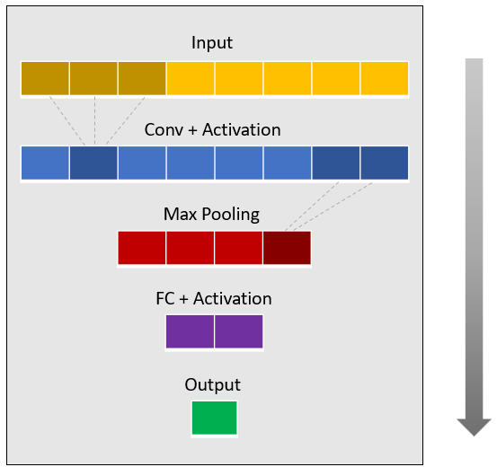
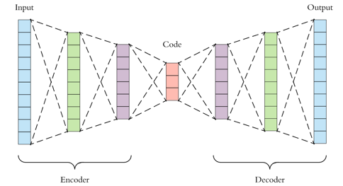

## Machine Learning Module
This module provides two models to detect anomalies in flow logs, both are based on neural networks.

 

### Fully Convolutional Network (FCN)
Implemented in *cnn_regression()*. This network is designed to detect *contextual anomalies* in 1d time series. Given k-consequtive values of a time series, the network tries to predict the next value. Anomalies can be defined as the values which the network fails to predict.

#### Structure
This model is implemented by a (potentially deep) neural network, which consists of 4 main layers: Input, output, a convolution layer 
and a fully-connected layer. The Conv layer is down-sampled by a Max Pooling operation; The output of both Conv and FC layers is transformed by an activation function. The convolution is performed in the temporal axis, relying on the existence of temporal patterns
in the input. 

   

#### How to Detect Anomalies?
1. Use *shingle()* to create the data set and the labels set. Each data point consists of k-consecutive values of the time series,
and each label is the next value of the corresponding data point.  
2. Split each set into train and test sets, and feed the network.  
3. Assign an anomaly score for each instance (the distance between the predicted and the real values, calculated by some metric).  
4. Define the instances that received the highest scores as anomalous.

 
 

### Fully Connected Autoencoder (AE)
Implemented in *FC_autoencoder()*. This network is designed to detect *point anomalies* in multi dimensional signals. Given a k-dimension signal, the network learns to generate an efficient l-dimension encoding (l<k) which allows reconstructing the original signal with minimal error. Anomalies can be defined as the points which the network fails to reconstruct. 

#### Structure
This model is implemented by a neural network which contains one hidden layer (fully connected). The content of the hidden layer represents the encoding of the input. The input and output layers are of the same dimension. The network minimizes the error which is defined by the distance between the input and the output.

   

#### How to Detect Anomalies? 
1. Split the data into train and test sets and feed the network (labels are not required).  
2. Assign an anomaly score for each instance (the distance between the reconstructed and the real values, calculated by some metric).  
3. Define the instances that received the highest scores as anomalous.

#### Feature Extraction
The *curse of dimensionality* is a well-known difficulty arises in multiple machine learning tasks, including anomaly detection. Traditionally used as a dimensinality reduction mechanism, autoencoder provides an automatic solution of this issue. practically speaking, instead of just the raw signal, the input of an anomaly detector can be the encoding generated by AE. This encoding is provided by *FC_autoencoder()* as an output (together with the reconstructed signal), allowing the fruitful composition of Analytics AE with Analytics FCN.

 
 

### Advanced Features of Machine Learning Module
Both FCN and AE are implemented in Tensorflow, providing the developer full control over the network structure. 
Inspired by higher-level modules such as Keras, the following features are embedded in Analytics Machine Learning functions:
* Continuous Learning. Both models are designed to deal with continous tasks, in which the network might be trained multiple times
with different data sets. By passing *is_initial=False*, the previous Tensorflow graph is being resotred, allowing the training phase
to resume from the point it stopped.
* Overfitting Avoidance. This feature can be achieved by using one (or more) of the following mechanisms:
  1. Early Stopping - Stops the training phase when the test error increases in multiple consecutive epochs (the amount is defined by *tolerance*).
  2. Regularization - Limits the size of the network weights by adding a regularization term to the objective (defined by *reg_coeff*).
