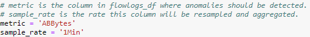
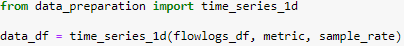
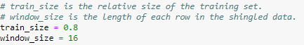
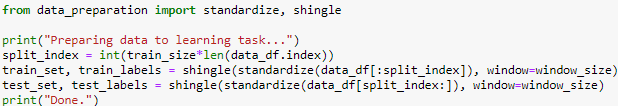
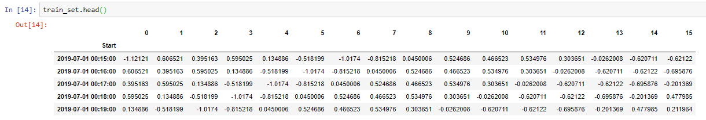
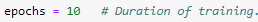
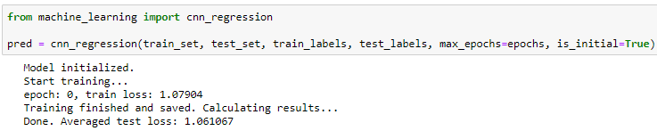
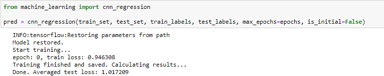
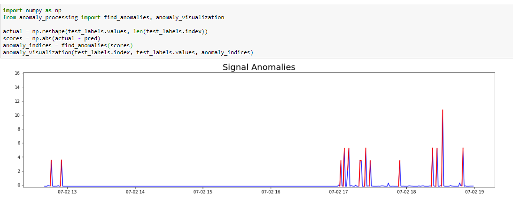
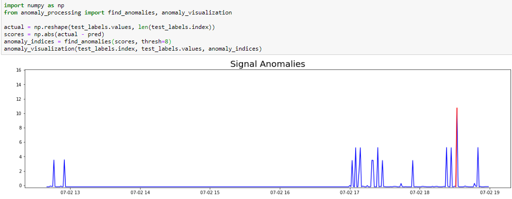

## Anomaly Detection 
This tutorial demonstrates how to use Analytics to find anomalies in VPC Flow Logs. 
If you are still not familiar with Analytics, consider starting with the *hello world* tutorial.

### Preparing the Environment
1. Load *anomalies_cnn* into an IPython notebook running with Python 3.
2. Install Analytics (if needed).
3. Load the data into a Pandas DataFrame named *flowlogs_df*.

### Let's Start
* First we set the metric in which we look for anomalies and the aggregation interval length:  

  
 
 

* Now we call *time_series_1d()* which extracts the relevant column and resamples it. Simply run the corresponding cell:  

  
 
 

* Our raw data is ready. But before feeding the time-series predictor, we should split the data into train and test set; After that we can standardize and shingle each set. First set the relevant hyper-parameters:

  
 
 

* And now prepare the data for prediction by simply running the corresponding cell:

 
 

* We can verify that our data is properly standardized and shingled:

  
 
 

* Great! Our data is ready for the learning task. 
Now we define the learning duration:

  
 
 

* And run our CNN predictor by simply running the corresponding cell: 

  
 
 

* Note that we got a test error of 1.06. We can try to improve the results by extending the learning phase; We pass *is_initial=False* to continue the learning from the stopping point:

  
 
 

* Indeed, we got a better error now. We are ready to visualize the anomalies!  
First, we set an *anomaly_score* for each time by calculating the distance between the prediction and the real value.   
Next, we find extremely-high scores by passing the anomaly scores to *find_anomalies()*.   
Last, we plot the results by calling to *anomaly_visualization()* (Anomalies will be marked by red).  
We can execute the whole process by running the last cell of this notebook:

 
 

* Nice! As we could expect, the large splikes are spotted as anomalies. We can decide when a score is anomalous by passing an explicit threshold to *find_anomalies()*. For example, lets increase the threshold to be *AVG + 8xSTD*:

 
 

* Thats it! In this tutorial we learned how to use Analytics module for anomaly detection in 1d time-series. Wish you find it useful!
