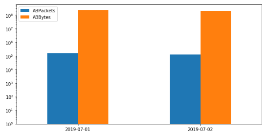

# Hello World
This tutorial describes how to install, import and use a simple Analytics notebook. 

## Instructions
1. Load *daily_traffic* into an IPython notebook running with Python 3.
2. Install *Analytics* package by uncommenting and running the code in the first cell.
3. Download *data/data_example.csv* to your local machine.
4. Upload the data into your notebook as a Pandas DataFrame named *flowlogs_df*.
5. Run the last cell to get the following reults:

Congratulations! :sparkles: 
The first tutorial is done. Now we are ready to perform some analytics! 
